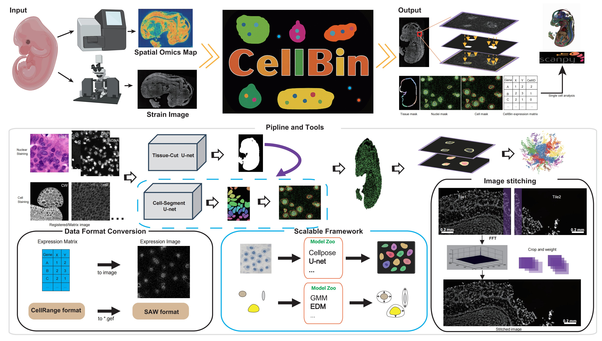

<div align="center">
  <br/>
  <h1 align="center">
    CellBin: a generalist framework to process spatial omics data to cell level
  </h1>
</div>

## Introduction
CellBin is an image processing pipeline designed to delineate cell boundaries for spatial analysis. It consists of several image analysis steps. Given the image and gene expression data as input, CellBin performs image registration, tissue segmentation, nuclei segmentation, and molecular labeling (i.e., cell border expanding), ultimately defining the molecular boundaries of individual cells. It incorporates a suite of self-developed algorithms, including deep-learning models, for each of the analysis task. The processed data is then mapped onto the chip to extract molecular information, resulting in an accurate single-cell expression matrix. (Cover image) For more information on CellBin, please refer to the following link.

**Cellbin2** is an upgraded version of the original [CellBin](https://github.com/STOmics/CellBin) platform with two key enhancements:
1. **Expanded Algorithm Library**: Incorporates additional image processing algorithms to serve broader application scenarios like single-cell RNA-seq, Plant cellbin.
2. **Configurable Architecture**: Refactored codebase allows users to customize analysis pipelines through [JSON](cellbin2/config/demos/sample.json) and [YAML](cellbin2/config/cellbin.yaml) configuration files.

***Tweets*** <br>
[Stereo-seq CellBin introduction](https://mp.weixin.qq.com/s/2-lE5OjPpjitLK_4Z0QI3Q) (Chinese)  <br>
[Stereo-seq CellBin application intro](https://mp.weixin.qq.com/s/PT3kPvsmrB3oQleEIMPkjQ)  (Chinese)  <br>
[Stereo-seq CellBin cell segmentation database introduction](https://mp.weixin.qq.com/s/OYJhAH6Bq1X1CQIYwugxkw) (Chinese)  <br>
[CellBin: The Core Image Processing Pipeline in SAW for Generating Single-cell Gene Expression Data for Stereo-seq](https://en.stomics.tech/news/stomics-blog/1017.html) (English)  <br>
[A Practical Guide to SAW Output Files for Stereo-seq](https://en.stomics.tech/news/stomics-blog/1108.html) (English)  <br>

***Paper related*** <br>
[CellBin: a highly accurate single-cell gene expression processing pipeline for high-resolution spatial transcriptomics](https://www.biorxiv.org/content/10.1101/2023.02.28.530414v5) [(GitHub Link)](https://github.com/STOmics) <br>
[Generating single-cell gene expression profiles for high-resolution spatial transcriptomics based on cell boundary images](https://gigabytejournal.com/articles/110) [(GitHub Link)](https://github.com/STOmics/STCellbin) <br>
[CellBinDB: A Large-Scale Multimodal Annotated Dataset for Cell Segmentation with Benchmarking of Universal Models](https://www.biorxiv.org/content/10.1101/2024.11.20.619750v2) [(GitHub Link)](https://github.com/STOmics/cs-benchmark) <br>

***Video tutorial*** <br>
[Cell segmentation tool selection and application](https://www.bilibili.com/video/BV1Ct421H7ST/?spm_id_from=333.337.search-card.all.click) (Chinese) <br>
[One-stop solution for spatial single-cell data acquisition](https://www.bilibili.com/video/BV1Me4y1T77T/?spm_id_from=333.337.search-card.all.click) (Chinese) <br>
[Single-cell processing framework for high resolution spatial omics](https://www.bilibili.com/video/BV1M14y1q7YR/?spm_id_from=333.788.recommend_more_video.12) (Chinese) 

## Installation and Quick Start
Linux
```shell
# Clone the main repository
git clone https://github.com/STOmics/cellbin2
# git clone -b dev_merge_paper https://github.com/STOmics/cellbin2

# Create and activate a Conda environment
conda create --name cellbin2 python=3.8
conda activate cellbin2

# Install package dependencies
cd cellbin2
pip install .[cp,rs]

# For development mode (optional):
# pip install -e .[cp,rs]      # Editable install with basic extras
# pip install -e .[cp,rs,rp]   # Editable install including report module

conda install conda-forge/label/main::pyvips==2.2.3

# Execute the demo (takes ~30-40 minutes on GPU hardware)
python demo.py
```

**Output Verification:**  
After completion, validate the output integrity by comparing your results with the [Outputs](#outputs). 

## Tutorials
### Core Workflow
The `cellbin_pipeline.py` script serves as the main entry point for CellBin2 analysis. 

📘 **Configuration Guide**:<br>

Customized configuration for different chips and experimental requirements can be achieved by writing JSON files or modifying our JSON file templates. You can find our JSON file templates in the `paper` folder. For full parameter specifications, check this: [JSON Configuration Documentation](docs/v2/JsonConfigurationDocumention.md).

### Command Template

```shell
# configuration information is in the .json file
CUDA_VISIBLE_DEVICES=0 python cellbin2/cellbin_pipeline.py -c SerialNumber -p paper/SerialNumber.json -o path/to/your/output_directory/SerialNumber
```
### Paper data running
**Introduction for running [dataset in paper](paper/README.md)**

**Instructions for using the [stitching tool](https://github.com/STOmics/cellbin2/tree/paper/cellbin2/contrib/stitch)**

### Parameters

| Parameter    | Description                                                                                                   | Examples                                                  |
| :----------- |:--------------------------------------------------------------------------------------------------------------|:----------------------------------------------------------|
| `-c`         | Serial number of the chip                                                                                         | `Z97502X8`                                                |
| `-p`         | Path to your customized configuration file<br/>  | [`config/custom.json`](cellbin2/config/demos/sample.json) |
| `-o`         | Path to your output directory                                                                                              | `results/Z97502X8`                                        |

## ErrorCode and Outputs
refer to [Main Readme.md](https://github.com/STOmics/cellbin2/blob/main/README.md)

## Reference
https://github.com/STOmics/CellBin <br>
https://github.com/MouseLand/cellpose <br>
https://github.com/matejak/imreg_dft <br>
https://github.com/rezazad68/BCDU-Net <br>
https://github.com/libvips/pyvips <br>
https://github.com/vanvalenlab/deepcell-tf <br>
https://github.com/ultralytics/ultralytics <br>
