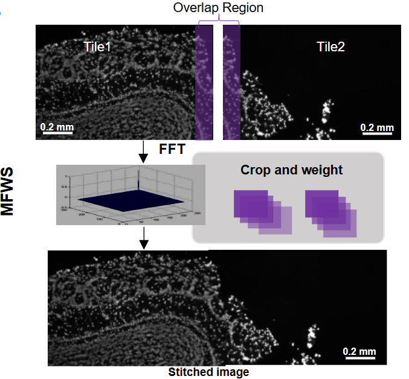

<div align="center">
  
  <h1 align="center">
    MFWS: Multiple FFT Weighted Stitching
  </h1>
</div>

## Introduction
We developed the image stitching algorithm named Multiple FFT Weighted Stitching (MFWS).
The algorithm procedures are as follows: 
* Calculate the overlap matrices of adjacent tiles in horizontal and vertical direction
* Obtain the global coordinates of each tile
* Complete the image mosaic and fusion generation

## Installation
```shell
pip install mfws
```

## Tutorials
We will use 3 scenario data to illustrate 2 usage methods. The parameters listed in the table below are helpful for using the tool.


| Name        | type    | Importance  | Default value | memo                                                                                                     |
|-------------|---------|-------------|---------------|----------------------------------------------------------------------------------------------------------|
| input       | string  | Required    | &#9744;       | File directory path                                                                                      |
| output      | string  | Required    | &#9744;       | Output file path or directory path                                                                       |
| rows        | integer | Required    | &#9744;       | Maximum number of scan row                                                                               |
| cols        | integer | Required    | &#9744;       | Maximum number of scan column                                                                            |
| start_row   | integer | Optional    | 1             | Start row of image to be stitched, start with 1 instead of 0                                             |
| start_col   | integer | Optional    | 1             | Start col of image to be stitched, start with 1 instead of 0                                             |
| end_row     | integer | Optional    | rows          | End row of image to be stitched                                                                          |
| end_col     | integer | Optional    | cols          | End col of image to be stitched                                                                          |
| proc        | integer | Optional    | 1             | Number of processes used, should be set reasonably based on the computing power of the hardware platform |
| overlapx    | float   | Optional    | 0.1           | Number of overlapping pixels in the horizontal direction / width of FOV                                  |
| overlapy    | float   | Optional    | 0.1           | Number of overlapping pixels in the vertical direction / height of FOV                                   |
| fusion      | integer | Optional    | 1             | Fusion Solution: 1 - no fusion, 2 - with sin method                                                      |
| scan_type   | integer | Optional    | 1             | Scanning method:                                                                                         |
| device      | string  | Optional    | cellbin       | Device Type: cellbin, T1, dolphin                                                                        |
| thumbnail   | float   | Optional    | 1             | Downsampling control parameter, a decimal between 0 and 1                                                |
| method      | integer  | Optional    | 1             | Stitching method: 1 - mfws, 2 - Use overlao to complete mechanical stitching                             |
| channel     | string  | Optional    | ''            | In a multi-layer image scenario, the labels of the layers to be spliced                                  |
| fft_channel | integer  | Optional    | 0             | Channel used to calculate translation                                                                    |
| name_pattern   | string  | Optional    | ''              | Regular expression matching characters, used to parse the file name to get the row and column index      |


### case 1: command line

You can use ```mfws -h``` to view the usage, use ```mfws -v``` to view software version information. 

- cellbin
```shell
mfws 
-i '/data/image_path' 
-o '/data/output_path' 
-overlap 0.1
-s  # if not need scope stitch, just not need to fill in
-f  # if not need fuse image, just not need to fill in
-n image 
-row 1_3 
-col 0_2
-d 2
```


- Dolphin
```shell
mfws 
-i '/data/image_path'  
-o '/data/output_path'  
-n dolphin 
-overlap 0.1_0 
-row 1_10 
-col 1_10 
-file_type *.A.*.tif 
-id dolphin 
```

- T1
```shell
mfws 
-i '/data/image_path'  
-o '/data/output_path'  
-n T1 
-overlap 0.07925_0.07925 
-row 1_10 
-col 1_10 
-file_type *.A.*.tif 
-id T1 
```

### case 2: API

```python
from mfws.mfws import stitching


image_path = '/path/mfws/images'
stitching(
    image_path = image_path,
    overlap = '0.1_0.1',
    scope_flag = True,
    rows = 20,
    cols = 10,
    start_row = 1,
    start_col = 1,
    end_row = 20,
    end_col = 10,
    fuse = 1,
    output_path = r"/path/mfws/images/output/mfws_test.tif"
)
```
